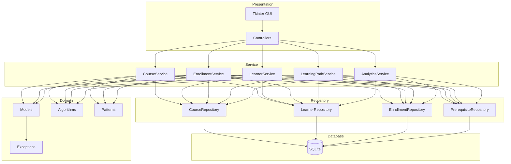
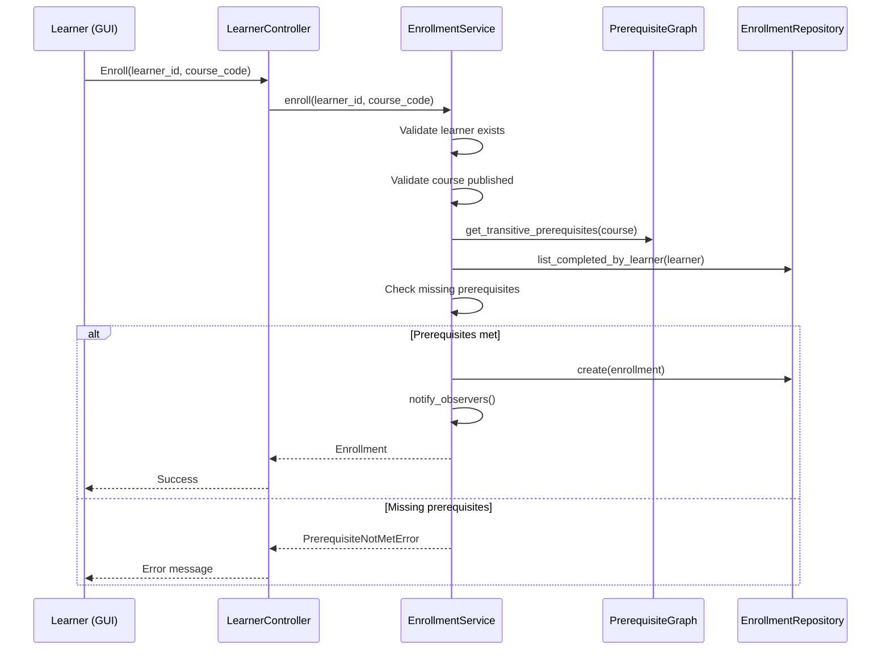
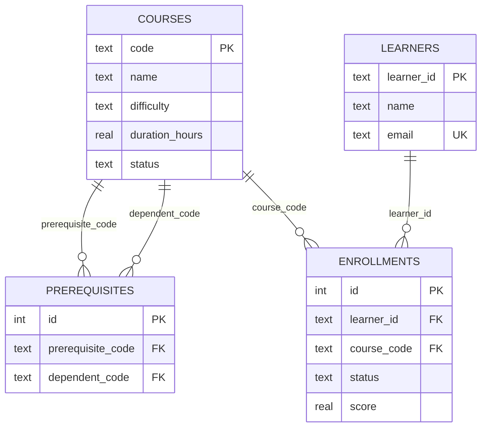

# Architecture

## Layered Architecture

LMPTS follows strict layered architecture with unidirectional dependencies:

## Dependency Rules

1. **Domain Layer** never depends on GUI, services, or database
2. **Service Layer** never contains SQL
3. **Repository Layer** hides database implementation
4. **GUI** communicates only through controllers → services

## Module Responsibilities

| Module | Responsibility |
|--------|----------------|
| `core/models.py` | Domain entities with OOP encapsulation |
| `core/algorithms.py` | Graph algorithms (independent of persistence) |
| `core/patterns.py` | Design pattern implementations |
| `core/exceptions.py` | Domain exception hierarchy |
| `data/database.py` | Connection management (Singleton) |
| `data/repository.py` | CRUD abstractions (Repository Pattern) |
| `services/*.py` | Business rule orchestration |
| `gui/*.py` | User interface (MVC) |

## Sequence: Enrollment Flow

## ER Diagram

